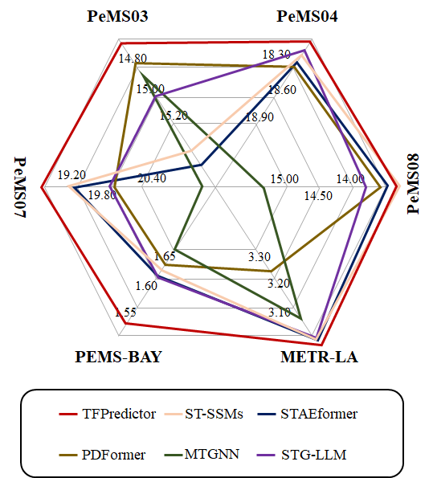

## TFPredictor: A Multi-scale Selective State Space Model for Traffic Flow Prediction

### Abstract

> *Most advanced traffic-forecasting methods rely on fixed temporal resolutions to handle both short-term and long-term variations in traffic flow, concentrating on capturing fixed-scale relationships among nodes in spatiotemporal graph networks. However, this fixed approach can lead to incomplete scale modeling and limit the model's adaptability to complex traffic dynamics. To overcome these challenges, we introduce a novel multi-scale Selective State Space Model (SSSM) named TFPredictor for traffic forecasting. TFPredictor features four key components: (a) multi-scale decomposition of input sequences via Fast Fourier Transform (FFT) to capture diverse periodic information in the frequency domain; (b) adaptive spatiotemporal modeling through the Kalman Filtering Graph Neural Network (KFGNN); (c) dynamic system analysis using TFPredictor to simulate state evolution accurately over time in spatiotemporal graph networks; and (d) multi-scale fusion via the Scale-weighted Kolmogorov-Arnold Network (ScaKAN) to assess and capture the significance of each scale and inter-scale correlations. Extensive empirical evaluations on six benchmark traffic-forecasting datasets reveal that TFPredictor achieves significant improvements in predictive performance and computational efficiency. Additionally, by visualizing the learned spatial representations and predictions across different scales, we enhance the model's interpretability. Code is available at https://github.com/wanjiashan/TFPredictor**

Index Terms—Selective state space model, traffic flow, multi-scale, Kolmogorov-Arnold network

<div align="center">
  
</div>

To address the limitations of existing methods that use fixed temporal resolution, we propose a multi-scale Selective State Space Model named TFPredictor. TFPredictor includes multi-scale decoupling and fusion modules, a state graph structure generator, and the Graph-Mamba block, comprehensively capturing multi-scale temporal patterns and enhancing the model's multi-scale modeling capability.
We employ an SSSM to handle the traffic network, treating it as a dynamic system to simulate state evolution deeply along the temporal dimension, thereby enhancing the understanding of the system-level dynamics of the traffic network.
<div align="center">
  
</div>


Loss trend comparison between TFPredictor and other benchmark models at different epoch counts
provides a detailed comparison of loss trends with increasing epochs under different architectures. From the analysis, it is evident that the Mamba model has significant advantages over Transformer-based models. To quantify the performance advantages of the ScaKAN component in the model further, we present the loss trends for MLP and ScaKAN in our model in Fig.ScaKAN outperforms MLP, with the 4-layer KAN structure performing the best. Its loss decreases rapidly to the minimum level after relatively few epochs and remains stable. This indicates that ScaKAN not only provides more accurate prediction results but also maintains consistency under different traffic conditions, which is crucial for real-world traffic prediction scenarios.
We design a model with linear time ${\cal O}\left( n \right)$ complexity, which not only improves prediction accuracy but also effectively shortens inference time, reduces computational costs, and enhances the model's practicality and scalability.

## 2. Training Procedure
### (1) Datasets

We evaluate the performance of TFPredictor on six major
traffic flow prediction benchmark datasets: METR-LA, PEMS-BAY, PEMS03, PEMS04, PEMS07, and PEMS08. The time
interval for each dataset is 5 minutes, resulting in 12 time
frames per hour. These datasets are widely used in traffic
prediction research and cover various traffic conditions and
challenges. For more information about these datasets, please
refer to Table I.


<b>PEMS04</b>: A benchmark in spatiotemporal data mining & traffic forecasting. [Data Source](link)

<b>METR-LA</b>:Traffic data from 207 sensors in Los Angeles highways. [Data Source](https://github.com/laekov/Traffic-Data).

<b>PEMS-BAY</b>: Traffic data from 325 sensors across the Bay Area, California. [Data Source](link).


### (2) Network Parameter Tuning

This study comprehensively evaluates TFPredictor and compares it with several state-of-the-art baseline models. We report the performance of each model in terms of RMSE, MAE, and MAPE performance metrics in Tables 2 and 3. The main findings are as follows:
(1) Overall superior performance: TFPredictor performs well across different datasets and prediction ranges, outperforming other baseline models in all metrics, highlighting TFPredictor's leading position in the field of traffic flow prediction.
(2) Transformer-based models: Models such as STAEformer show different performance on different datasets. This difference in performance is attributed to the limitations of traditional attention mechanisms in handling complex spatiotemporal embeddings.
(3) GNN-based models: GNN methods using static graphs such as DCRNN, STGCN, and MTGNN generally perform poorly. Dynamic graph models such as STPGNN perform well on some datasets. Their success is attributed to their use of dynamic graph structures to enhance the dynamic connections between key nodes, thereby better capturing the dynamic spatial associations in traffic networks. However, the overall performance is still slightly inferior to that of SSMs models.
(4) Application of Large Language Models (LLMs): LLMs show significant advantages in spatiotemporal prediction, especially when dealing with complex data and predicting future trends. However, the complexity and opacity of LLMs may lead to difficulties in interpretation, making it difficult to understand the reasons behind the model predictions.
(5) Performance on specific datasets: On the PEMS-BAY and METR-LA datasets, TFPredictor demonstrates its excellent fitting ability for complex multi-scale dependencies and relationships between variables.
In summary, TFPredictor shows significant advantages in complex time series prediction tasks through its innovative multi-scale dynamic graph representation and effective multi-scale fusion mechanism.


accuracy performance of transformer models, gnns, llms, and ssms on the pems-bay and metr-la datasets. the best results are highlighted in bold, and the second-best results are underline.


### (3) Benchmarks Models
We train benchmark models such as <a href="https://github.com/LincanLi98/STG-Mamba" target="_blank">STG-Mamba</a>, <a href="https://github.com/XDZhelheim/STAEformer" target="_blank">STAEformer</a>, <a href="https://github.com/BUAABIGSCity/PDFormer" target="_blank">PDFormer</a>, <a href="https://github.com/chnsh/DCRNN_PyTorch" target="_blank">DCRNN</a>, <a href="https://github.com/hazdzz/STGCN" target="_blank">STGCN</a>, <a href="https://github.com/nnzhan/MTGNN" target="_blank">MTGNN</a>, <a href="https://github.com/zhengchuanpan/GMAN" target="_blank">GMAN</a>, ,<a href="https://github.com/LiuAoyu1998/STIDGCN" target="_blank">STIDGCN</a>, <a href="https://github.com/wengwenchao123/DDGCRN" target="_blank">DDGCRN</a> ,<a href="https://github.com/LeiBAI/AGCRN" target="_blank">AGCRN</a>, and <a href="https://github.com/nnzhan/Graph-WaveNet" target="_blank">Graph-WaveNet</a> based on the same sample set.

## 3.run
First, you need to compress the data set. For example, when running PEMSBY, adjust the parameters in prepare.py if speed_sequences.shape[2] > 325: speed_sequences = speed_sequences[:, :, :325] and the parameter mamba_features=325 in train_STGmamba. This corresponds to the characteristics of the specific data set. For example, PESMBY is 325, and metr-la is 207. You need to adjust it and run the code.
```bash
#PEMS04
  python main.py -dataset=PREMS04 -model=TFPredictor -mamba_features=307
```
```bash
#PESMSBY
  python main.py -dataset=PEMSBY -model=TFPredictor -mamba_features=325 
```
```bash
#metr-la
  python main.py -dataset=metr-la -model=TFPredictor -mamba_features=207
```

## 4. Conclusion
  In this paper, we explored the multi-scale Selective State Space Model, TFPredictor, in detail and evaluated its effectiveness in handling spatiotemporal data, particularly in critical traffic flow prediction tasks, where the model can effectively model and predict sequence data. By introducing KFGNN, TFPredictor achieves dynamic evolution of the spatiotemporal graph adjacency matrix, which is closely integrated with the SSSM process of the entire graph. Additionally, we introduced the Graph-Mamba block, a module designed based on the SSSM to optimize graph data processing. Using the ScaKAN architecture for the multi-scale fusion module, TFPredictor ensures effective cross-scale correlation capture, improving the accuracy and robustness of multi-scale representations. Compared to attention-based methods, TFPredictor significantly reduces inference time while maintaining linear time complexity.
Extensive empirical studies conducted on multiple traffic datasets demonstrate that TFPredictor outperforms other benchmark methods in both prediction performance and computational efficiency. Furthermore, we performed an in-depth interpretability analysis on the PEMS-BAY and METR-LA datasets, showcasing the interpretative capability of the TFPredictor model.
Future research will delve deeper into the interpretability of the ScaKAN component in the TFPredictor model, focusing on identifying the impact of traffic patterns at different time scales on traffic flow. Advances in this area are expected to enhance the accuracy and reliability of traffic flow prediction models significantly, promoting more precise traffic management and planning applications.
